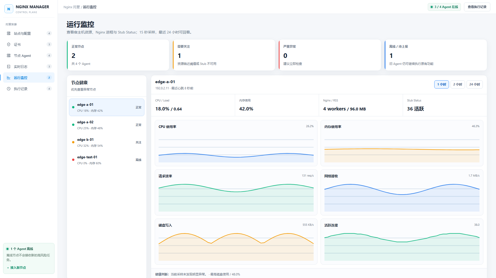
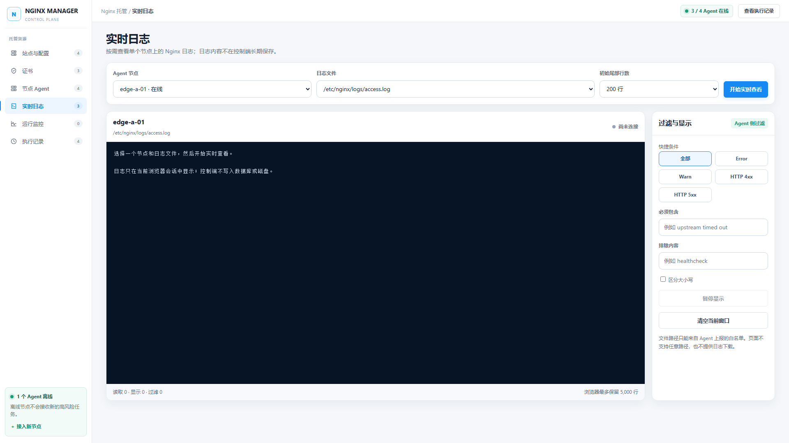

# Lightweight Nginx Manager（轻量级 Nginx 管理平台）

一个轻量、自托管的多节点 Nginx 管理平台。通过 Web 控制台统一管理 Linux 节点上的域名站点、HTTP/Stream Conf 与 TLS 证书，支持多个配置入口、现有配置导入、编辑、复制、逐节点校验、发布、回滚和审计。

Server 基于 FastAPI、SQLite 和单文件 Web 控制台；Agent 主动连接 Server，无需开放管理端口，也不提供任意 Shell。适合从少量节点开始部署并逐步扩展。

## 界面预览


| 运行监控 | 实时日志 |
| --- | --- |
|  |  |

## 快速安装

### 1. Server（默认 HTTP）

```bash
curl -fsSL https://raw.githubusercontent.com/zhangldaniel/lightweight-nginx-manager/main/install-server.sh | \
sudo bash -s -- \
  --host 192.0.2.20 \
  --port 8443 \
  --open-firewall
```

将示例 IP 换成实际 Server IP，然后访问 `http://192.0.2.20:8443`。`--public-url` 可以不写。

- 账号：`admin`
- 密码：首次安装随机生成，没有固定默认密码
- 查看密码：`sudo cat /root/nginx-manager-credentials.txt`

### 2. Agent（系统默认 Nginx）

```bash
curl -fsSL https://raw.githubusercontent.com/zhangldaniel/lightweight-nginx-manager/main/install-agent.sh | \
sudo bash -s -- \
  --server http://192.0.2.20:8443 \
  --node-name edge-a-01
```

### 3. Agent（已有 `/apps/nginx`）

下面的例子直接托管已经被 `nginx.conf` 加载的 `/apps/nginx/conf/conf.d`：

```bash
curl -fsSL https://raw.githubusercontent.com/zhangldaniel/lightweight-nginx-manager/main/install-agent.sh | \
sudo bash -s -- \
  --server http://192.0.2.20:8443 \
  --node-name edge-a-01 \
  --nginx-binary /apps/nginx/sbin/nginx \
  --nginx-root /apps/nginx \
  --nginx-config /apps/nginx/conf/nginx.conf \
  --managed-config-dir /apps/nginx/conf/conf.d \
  --managed-config-already-included \
  --managed-cert-dir /apps/nginx/cert \
  --nginx-log-dir /apps/nginx/logs \
  --stub-status-url http://127.0.0.1:18080/nginx_status \
  --allow-plaintext-log-stream \
  --nginx-service nginx.service
```

如果一台 Nginx 有多个 HTTP 配置目录，可重复传入：

```bash
  --managed-config-dir /apps/nginx/conf/conf.d \
  --managed-config-dir /apps/nginx/conf/sites.d \
  --managed-config-already-included
```

如果同一目录还加载 Stream 文件：

```nginx
http {
    include /apps/nginx/conf/conf.d/*.conf;
}

stream {
    include /apps/nginx/conf/conf.d/*.stream;
}
```

对应的 Agent 参数为：

```bash
  --managed-config-dir /apps/nginx/conf/conf.d \
  --managed-stream-dir /apps/nginx/conf/conf.d \
  --managed-config-already-included
```

`--managed-config-dir` 与 `--managed-stream-dir` 都可以重复。每种类型的第一个目录是默认写入入口；创建或复制配置时，也可以为每个节点单独选择目标入口。平台只管理入口目录的直接子文件，不递归扫描子目录：HTTP 仅接受 `*.conf`，Stream 仅接受 `*.stream`。

Agent 会用真实的 `nginx -T` 确认每个入口确实被加载。符号链接目录会被拒绝，符号链接文件只读显示。入口只能通过 root 重新执行安装命令调整，不能从 Web 临时扩大写入范围。

安装完成后进入 Web 的“节点 Agent”批准申请，不需要注册令牌。然后分别点击“导入节点现有配置”和证书页的“扫描节点证书”。扫描只读，私钥内容不会离开节点。

“站点与配置”顶部可按 Agent 切换列表；右侧会显示所选节点的实际配置路径、Hash 和配置预览。升级后重新导入一次，可补齐旧站点的节点配置快照。

`--nginx-log-dir` 可重复指定，只允许实时读取目录内的普通 `*.log`；控制端不把日志正文写入 SQLite 或磁盘。HTTP 管理网必须显式添加 `--allow-plaintext-log-stream`，该参数在 HTTPS 下也可以保留，不会关闭 TLS 或改变 Server 地址。

`--stub-status-url` 仅接受本机回环地址。暂时不可访问不会阻断安装，Agent 会继续重试。可在 Nginx 中增加：

```nginx
server {
    listen 127.0.0.1:18080;
    server_name localhost;
    access_log off;
    location = /nginx_status {
        stub_status;
        allow 127.0.0.1;
        deny all;
    }
}
```

“运行监控”每 15 秒采集宿主机、Nginx 进程和 Stub Status；原始数据保留 2 小时，分钟级历史保留 24 小时。“实时日志”一次查看一个节点上的一个文件，浏览器最多保留 5,000 行。

## 配置方式

“新增配置”中提供：

- **向导站点**：填写域名和上游，由平台生成基础配置。
- **站点 Conf**：直接编写包含业务 `server_name` 的站点配置，可绑定证书。
- **通用 Conf**：托管 `upstream`、`map`、`geo`、限流区和本机 Stub Status 等 HTTP 片段，不要求域名或证书。
- **Stream Conf**：托管 TCP/UDP `server`、`upstream` 等 Stream 片段，使用 `.stream` 文件；证书路径直接写在正文中。

平台不解析或限制 Conf 中的 Nginx 指令，`auth_basic`、第三方模块和其他合法指令均直接交给目标节点的真实 `nginx -t` 校验。Agent 仍只允许写入已注册入口，并保留 SHA-256 并发保护、原子替换、失败恢复与 reload 回滚。使用 `include`、动态模块或其他高权限指令时，安全责任由操作者承担。

通用 Conf 只填写文件名，完整目录由每个 Agent 的目标入口决定。如果目标节点已有同名文件，必须先“导入节点现有配置”取得路径和 SHA-256，平台不会盲目覆盖。HTTP 配置只能复制到 HTTP 入口，Stream 配置只能复制到 Stream 入口；同一节点切换入口会在一个事务中写入目标并删除源文件，校验或 reload 失败会同时恢复。跨类型迁移需要新建配置并人工确认正文。

`--nginx-config` 指定的主配置会作为独立受保护资源显示，默认只能查看，不能删除、移动、重命名或复制。确实需要从平台修改时，重新安装 Agent 并显式增加：

```bash
  --allow-main-config-edit
```

即使开启，主配置仍不能删除。发布前后仍执行真实 `nginx -t`，失败自动恢复原文件。

## 最容易踩的坑

| 现象 | 原因与处理 |
| --- | --- |
| `/apps/nginx` 存在，但提示未发现 Nginx | 自动探测不覆盖自定义目录；使用上面的完整 `/apps/nginx` 参数。 |
| 配置已经导入，但证书页为空 | `--managed-cert-dir` 必须指向真实目录；`cert` 和 `certs` 是两个不同路径。修改参数后重新安装 Agent，再点击“扫描节点证书”。 |
| 配置没改，重复发布却显示失败 | 先升级 Server；新版会比较逐节点 SHA-256，内容一致时只执行 `nginx -t` 与 reload，不写文件、不增加版本。真正修改后仍失败时，检查配置中的 `ssl_certificate` 路径是否位于 `--managed-cert-dir`。 |
| 页面显示候选配置校验失败，但手工 `nginx -t` 成功 | 页面若同时显示“原文件已自动恢复”，手工检查的是恢复后的旧配置，这是正常现象。`proxy_pass` 必须带 `http://` 或 `https://`；向导模式会自动补齐简单的 IP、主机名和 upstream。新版也会显示候选配置的安全分类原因和大致行号。 |
| 发布前提示“Conf 格式不完整或包含不允许托管的指令” | 节点仍在运行旧版 Agent 的指令白名单；升级 Agent 到 `0.9.2+` 后重试，配置将直接交给目标节点的 `nginx -t`。 |
| 绑定证书后发布失败或浏览器报域名不匹配 | 证书必须同时存在于目标节点并覆盖站点域名；`*.itbkcmdb.int.example.com` 不覆盖 `test.int.example.com`。在“编辑配置”中更换绑定证书会自动更新证书路径。 |
| `nginx -t` 报 `bind() to 0.0.0.0:80 failed (13: Permission denied)` | 部分自编译 Nginx 在测试配置时也会绑定低端口；升级 Agent，安装器会为受限 helper/recover 单元保留 `CAP_NET_BIND_SERVICE`。 |
| `00-nginx-manager.conf has unexpected content` | 旧 include 文件和新托管目录冲突；先检查其内容。直接托管 `conf.d` 时不要再传 `--managed-include-file`。 |
| 托管 `conf.d` 后出现递归 include | 不要在 `conf.d` 中创建一个再次 include `conf.d/*.conf` 的文件；必须使用 `--managed-config-already-included`。 |
| Stream 文件没有导入 | `stream { include .../*.stream; }` 必须已存在，并同时传 `--managed-stream-dir` 与 `--managed-config-already-included`。Agent 不会自动改写主配置创建 `stream {}`。 |
| 新目录已注册，但发布提示“入口未被 Nginx 加载” | 安装器和发布流程都会以 `nginx -T` 为准；检查 include 后重新执行安装命令。只创建目录但没有 include 不算可写入口。 |
| 页面显示“入口已移除” | 该资源还指向 Agent 以前注册的入口。重新安装 Agent 恢复入口，或把配置复制/迁移到同类型的现有入口；平台不会悄悄改写目标目录。 |
| Agent 显示在线，但导入后仍为 0 | Server 和 Agent 都要升级；`grep '^VERSION' /opt/nginx-manager-agent/nginx_agent.py` 应至少显示 `0.10.0`，然后浏览器按 `Ctrl+F5` 再导入。 |
| “实时日志”没有节点或文件 | Agent 至少应为 `0.8.0`，并在安装时传入真实的 `--nginx-log-dir`。HTTP 管理网还要添加 `--allow-plaintext-log-stream`，然后等待一次心跳并刷新页面。 |
| 监控显示 Stub Status 不可用 | 检查 `curl http://127.0.0.1:18080/nginx_status` 是否返回 Active connections / Reading / Writing / Waiting；采集失败不会影响配置和证书操作。 |
| `find /apps/nginx/conf/nginx-manager.d` 为空 | 如果托管目录已经改为 `conf.d`，这是正常的；应检查 `/apps/nginx/conf/conf.d`。 |
| 从节点移除后站点仍在，并显示 `v1 → v2` | “从节点移除配置”只删除 Agent 上的 `.conf`，会保留平台记录；新版会显示“未部署”和原版本 `v1`。确认不再需要后，可在右侧点击“删除站点记录”。 |
| 点击“逐节点校验”后出现 `v1 → v2` | 升级 Server。逐节点校验是只读操作，新版只显示“校验中/校验失败”，不会创建草稿或增加版本；只有真正编辑配置才会出现候选版本。 |
| Agent 接入 `timed out` | 先从 Agent 执行 `curl --connect-timeout 5 http://192.0.2.20:8443/healthz`。能访问仍超时就重新执行最新 Agent 安装命令。 |
| 安装后没有默认密码 | 密码是随机生成的，查看 `/root/nginx-manager-credentials.txt`。升级不会重置账号密码。 |
| CentOS 7 只有 Python 3.6 / systemd 219 | 最新 Agent 已兼容，不需要手工升级 Python；重新执行安装命令即可。 |

如果以前创建过旧 include 文件，只在确认它确实是旧的 Manager 引用后再迁移：

```bash
sudo cat /apps/nginx/conf/conf.d/00-nginx-manager.conf
sudo cp -a /apps/nginx/conf/conf.d/00-nginx-manager.conf /root/00-nginx-manager.conf.backup
sudo rm -f /apps/nginx/conf/conf.d/00-nginx-manager.conf
sudo /apps/nginx/sbin/nginx -t -c /apps/nginx/conf/nginx.conf && sudo systemctl reload nginx
```

不要直接删除内容不明的生产配置。

## HTTPS 与 LDAP

HTTP 只适合隔离且可信的管理网。使用本机 Nginx 终止 HTTPS：

```bash
sudo ./deploy/install-server.sh \
  --host nginx-manager.example.com \
  --behind-nginx \
  --port 8443
```

代理示例见 `deploy/nginx-manager-proxy.conf.example`。如果同时保留 `http://服务器IP:8443`，增加 `--allow-direct-http`。

LDAP/AD 参数见 `sudo ./deploy/install-server.sh --help`。至少需要：

```text
--ldap-url
--ldap-base-dn
--ldap-bind-dn
--ldap-bind-password-file
```

默认角色组为 `nginx-admin`、`nginx-operator`、`nginx-auditor`；本地 `admin` 始终作为应急账号保留。

## 升级与检查

升级 Server 或 Agent：重新执行原安装命令。Server 保留数据库和账号，Agent 保留已批准的机器身份。涉及发布任务协议的版本应先升级 Server，再升级所有 Agent，最后浏览器 `Ctrl+F5`。

新版发布有服务端操作单、逐节点任务租约和不可变版本快照。Agent 在网络中断时会将结果保存在 `/var/lib/nginx-manager-agent/result-outbox.json`，收到 Server 确认后才删除；永久被拒绝的结果会留在 `result-outbox-rejected.json` 供排查。多节点发布可能出现“部分成功”，页面会明确保留逐节点结果，不会把它伪装成全部成功。

真实版本回滚只适用于升级后成功发布并形成快照的版本；升级前仅有页面历史文字、没有配置快照的旧版本不能自动回滚。升级前先备份 Server：

```bash
# Server
systemctl status nginx-manager
journalctl -u nginx-manager -f
curl -fsS http://127.0.0.1:8443/healthz

# Agent
systemctl status nginx-manager-agent nginx-manager-agent-helper
journalctl -u nginx-manager-agent -f

# 自定义 Nginx
/apps/nginx/sbin/nginx -t -c /apps/nginx/conf/nginx.conf
```

Server 备份：

```bash
sudo ./deploy/backup-server.sh
```

生产环境不要长期从可变的 `main` 直接以 root 安装。确认一个已审核的 40 位 commit 后固定它：

```bash
export NGINX_MANAGER_REF='<40位Git提交>'
export NGINX_MANAGER_REQUIRE_PINNED_REF=1
curl -fsSL "https://raw.githubusercontent.com/zhangldaniel/lightweight-nginx-manager/${NGINX_MANAGER_REF}/install-server.sh" | \
sudo -E bash -s -- --host 192.0.2.20 --port 8443
```

Agent 安装同样设置这两个环境变量。也可以额外设置 `NGINX_MANAGER_ARCHIVE_SHA256` 校验 GitHub 源码归档。Server 默认只保留最近 3 个程序 release（数据与数据库不在 release 内），可用 `NGINX_MANAGER_RELEASE_RETENTION` 调整。

控制端默认保留任务/操作 30 天、审计 180 天；LDAP 会话每 5 分钟重新检查一次角色。对应环境变量见 `server/env.example`。证书替换任务在排队和租约重试期间会暂存在权限为 `0600` 的 Server SQLite 中，任务结束即删除私钥 payload；因此仍应保护 Server 磁盘、备份和管理网络。

## 一键卸载

默认卸载会保留数据或 Agent 身份；添加 `--purge` 才彻底删除。Agent 卸载器不会删除已经发布的 Nginx 配置和证书。

```bash
# Server
curl -fsSL https://raw.githubusercontent.com/zhangldaniel/lightweight-nginx-manager/main/uninstall-server.sh | sudo bash

# Agent
curl -fsSL https://raw.githubusercontent.com/zhangldaniel/lightweight-nginx-manager/main/uninstall-agent.sh | sudo bash
```

彻底卸载示例：

```bash
curl -fsSL https://raw.githubusercontent.com/zhangldaniel/lightweight-nginx-manager/main/uninstall-server.sh | sudo bash -s -- --purge
```

> HTTP 会明文传输登录会话、Agent 身份和任务内容；跨不可信网络必须使用 HTTPS。
