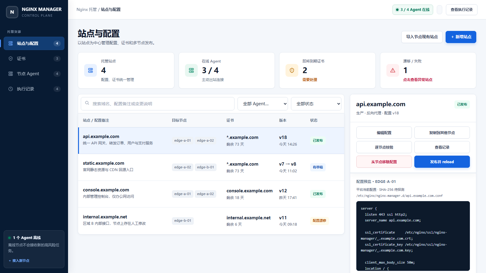

# Lightweight Nginx Manager（轻量级 Nginx 管理平台）

一个轻量、自托管的多节点 Nginx 管理平台。通过 Web 控制台统一管理 Linux 节点上的站点配置与 TLS 证书，支持现有配置导入、编辑、复制、逐节点校验、发布、回滚和审计。

Server 基于 FastAPI、SQLite 和单文件 Web 控制台；Agent 主动连接 Server，无需开放管理端口，也不提供任意 Shell。适合从少量节点开始部署并逐步扩展。

## 界面预览



## 快速安装

### 1. Server（默认 HTTP）

```bash
curl -fsSL https://raw.githubusercontent.com/zhangldaniel/lightweight-nginx-manager/main/install-server.sh | \
sudo bash -s -- \
  --host 192.0.2.20 \
  --port 8443 \
  --open-firewall
```

将示例 IP 换成实际 Server IP，然后访问 `http://192.0.2.20:8443`。`--public-url` 可以不写。

- 账号：`admin`
- 密码：首次安装随机生成，没有固定默认密码
- 查看密码：`sudo cat /root/nginx-manager-credentials.txt`

### 2. Agent（系统默认 Nginx）

```bash
curl -fsSL https://raw.githubusercontent.com/zhangldaniel/lightweight-nginx-manager/main/install-agent.sh | \
sudo bash -s -- \
  --server http://192.0.2.20:8443 \
  --node-name edge-a-01
```

### 3. Agent（已有 `/apps/nginx`）

下面的例子直接托管已经被 `nginx.conf` 加载的 `/apps/nginx/conf/conf.d`：

```bash
curl -fsSL https://raw.githubusercontent.com/zhangldaniel/lightweight-nginx-manager/main/install-agent.sh | \
sudo bash -s -- \
  --server http://192.0.2.20:8443 \
  --node-name edge-a-01 \
  --nginx-binary /apps/nginx/sbin/nginx \
  --nginx-root /apps/nginx \
  --nginx-config /apps/nginx/conf/nginx.conf \
  --managed-config-dir /apps/nginx/conf/conf.d \
  --managed-config-already-included \
  --managed-cert-dir /apps/nginx/cert \
  --nginx-service nginx.service
```

安装完成后进入 Web 的“节点 Agent”批准申请，不需要注册令牌。然后分别点击“导入节点现有站点”和证书页的“扫描节点证书”。扫描只读，私钥内容不会离开节点。

“站点与配置”顶部可按 Agent 切换列表；右侧会显示所选节点的实际配置路径、Hash 和配置预览。升级后重新导入一次，可补齐旧站点的节点配置快照。

## 最容易踩的坑

| 现象 | 原因与处理 |
| --- | --- |
| `/apps/nginx` 存在，但提示未发现 Nginx | 自动探测不覆盖自定义目录；使用上面的完整 `/apps/nginx` 参数。 |
| 配置已经导入，但证书页为空 | `--managed-cert-dir` 必须指向真实目录；`cert` 和 `certs` 是两个不同路径。修改参数后重新安装 Agent，再点击“扫描节点证书”。 |
| 配置没改，重复发布却显示失败 | 先升级 Server；新版会比较逐节点 SHA-256，内容一致时直接恢复为“已发布”，不重复写文件或 reload。真正修改后仍失败时，检查配置中的 `ssl_certificate` 路径是否位于 `--managed-cert-dir`。 |
| 页面显示候选配置校验失败，但手工 `nginx -t` 成功 | 页面若同时显示“原文件已自动恢复”，手工检查的是恢复后的旧配置，这是正常现象。`proxy_pass` 必须带 `http://` 或 `https://`；向导模式会自动补齐简单的 IP、主机名和 upstream。新版也会显示候选配置的安全分类原因和大致行号。 |
| 绑定证书后发布失败或浏览器报域名不匹配 | 证书必须同时存在于目标节点并覆盖站点域名；`*.itbkcmdb.int.example.com` 不覆盖 `test.int.example.com`。在“编辑配置”中更换绑定证书会自动更新证书路径。 |
| `nginx -t` 报 `bind() to 0.0.0.0:80 failed (13: Permission denied)` | 部分自编译 Nginx 在测试配置时也会绑定低端口；升级 Agent，安装器会为受限 helper/recover 单元保留 `CAP_NET_BIND_SERVICE`。 |
| `00-nginx-manager.conf has unexpected content` | 旧 include 文件和新托管目录冲突；先检查其内容。直接托管 `conf.d` 时不要再传 `--managed-include-file`。 |
| 托管 `conf.d` 后出现递归 include | 不要在 `conf.d` 中创建一个再次 include `conf.d/*.conf` 的文件；必须使用 `--managed-config-already-included`。 |
| Agent 显示在线，但导入后仍为 0 | Server 和 Agent 都要升级；`grep '^VERSION' /opt/nginx-manager-agent/nginx_agent.py` 应至少显示 `0.6.0`，然后浏览器按 `Ctrl+F5` 再导入。 |
| `find /apps/nginx/conf/nginx-manager.d` 为空 | 如果托管目录已经改为 `conf.d`，这是正常的；应检查 `/apps/nginx/conf/conf.d`。 |
| 从节点移除后站点仍在，并显示 `v1 → v2` | “从节点移除配置”只删除 Agent 上的 `.conf`，会保留平台记录；新版会显示“未部署”和原版本 `v1`。确认不再需要后，可在右侧点击“删除站点记录”。 |
| Agent 接入 `timed out` | 先从 Agent 执行 `curl --connect-timeout 5 http://192.0.2.20:8443/healthz`。能访问仍超时就重新执行最新 Agent 安装命令。 |
| 安装后没有默认密码 | 密码是随机生成的，查看 `/root/nginx-manager-credentials.txt`。升级不会重置账号密码。 |
| CentOS 7 只有 Python 3.6 / systemd 219 | 最新 Agent 已兼容，不需要手工升级 Python；重新执行安装命令即可。 |

如果以前创建过旧 include 文件，只在确认它确实是旧的 Manager 引用后再迁移：

```bash
sudo cat /apps/nginx/conf/conf.d/00-nginx-manager.conf
sudo cp -a /apps/nginx/conf/conf.d/00-nginx-manager.conf /root/00-nginx-manager.conf.backup
sudo rm -f /apps/nginx/conf/conf.d/00-nginx-manager.conf
sudo /apps/nginx/sbin/nginx -t -c /apps/nginx/conf/nginx.conf && sudo systemctl reload nginx
```

不要直接删除内容不明的生产配置。

## HTTPS 与 LDAP

HTTP 只适合隔离且可信的管理网。使用本机 Nginx 终止 HTTPS：

```bash
sudo ./deploy/install-server.sh \
  --host nginx-manager.example.com \
  --behind-nginx \
  --port 8443
```

代理示例见 `deploy/nginx-manager-proxy.conf.example`。如果同时保留 `http://服务器IP:8443`，增加 `--allow-direct-http`。

LDAP/AD 参数见 `sudo ./deploy/install-server.sh --help`。至少需要：

```text
--ldap-url
--ldap-base-dn
--ldap-bind-dn
--ldap-bind-password-file
```

默认角色组为 `nginx-admin`、`nginx-operator`、`nginx-auditor`；本地 `admin` 始终作为应急账号保留。

## 升级与检查

升级 Server 或 Agent：重新执行原安装命令。Server 保留数据库和账号，Agent 保留已批准的机器身份。

```bash
# Server
systemctl status nginx-manager
journalctl -u nginx-manager -f
curl -fsS http://127.0.0.1:8443/healthz

# Agent
systemctl status nginx-manager-agent nginx-manager-agent-helper
journalctl -u nginx-manager-agent -f

# 自定义 Nginx
/apps/nginx/sbin/nginx -t -c /apps/nginx/conf/nginx.conf
```

Server 备份：

```bash
sudo ./deploy/backup-server.sh
```

## 一键卸载

默认卸载会保留数据或 Agent 身份；添加 `--purge` 才彻底删除。Agent 卸载器不会删除已经发布的 Nginx 配置和证书。

```bash
# Server
curl -fsSL https://raw.githubusercontent.com/zhangldaniel/lightweight-nginx-manager/main/uninstall-server.sh | sudo bash

# Agent
curl -fsSL https://raw.githubusercontent.com/zhangldaniel/lightweight-nginx-manager/main/uninstall-agent.sh | sudo bash
```

彻底卸载示例：

```bash
curl -fsSL https://raw.githubusercontent.com/zhangldaniel/lightweight-nginx-manager/main/uninstall-server.sh | sudo bash -s -- --purge
```

> HTTP 会明文传输登录会话、Agent 身份和任务内容；跨不可信网络必须使用 HTTPS。
