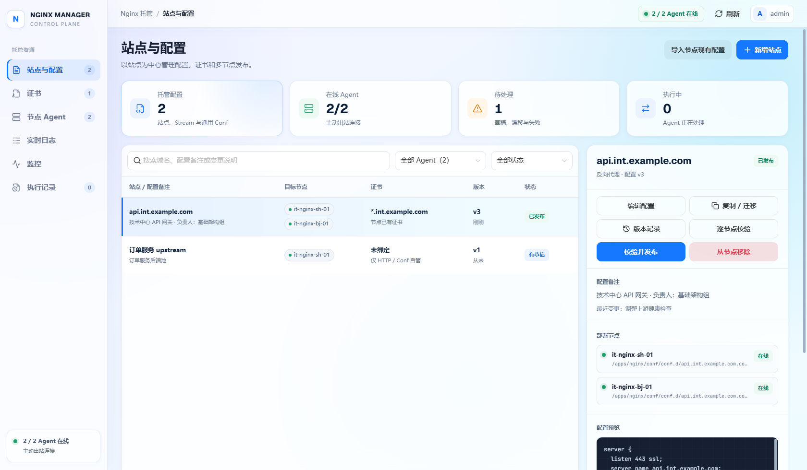
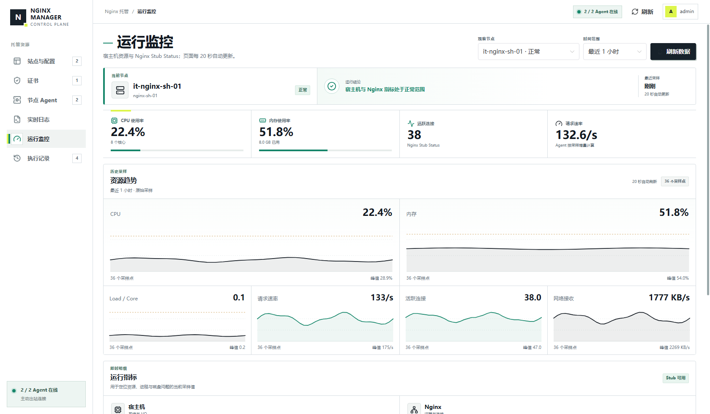
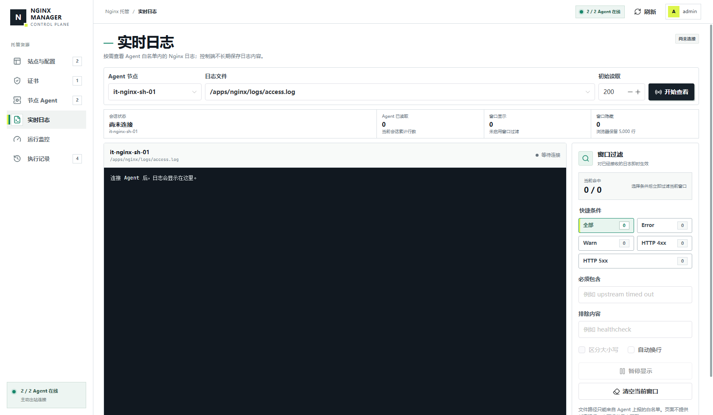

<div align="center">

# Nginx Steward

**轻量、自托管的 Nginx / Keepalived / LVS 管理台**

从一个 Web 页面管理多台 Linux 节点的配置、证书、日志与运行状态。

[](#-快速开始)
[](agent/README.md)
[](#安全边界)
[](#-文档)

[功能](#-主要功能) · [快速开始](#-快速开始) · [节点类型](#-选择节点类型) · [升级与迁移](#-升级备份与迁移) · [文档](#-文档)

</div>



Nginx Steward 由一个控制端和多个 Agent 组成。Agent 从节点主动连接控制端，不需要开放入站端口，也不提供任意 Shell。每次发布都会在目标节点执行真实的配置校验；校验或 reload 失败时，Agent 会恢复原文件。

## ✨ 主要功能

### 配置与证书

- 统一管理多节点 HTTP、Stream、主配置和多个配置目录
- 导入已有配置，复制到其他节点，迁移目录，查看版本并回滚
- 扫描节点证书，按原路径替换；扫描过程不会读取或上传私钥
- 为配置补充备注和截图，截图随控制端数据一起备份

### 安全发布

- 发布前逐节点执行 `nginx -t`
- 使用期望 Hash 防止覆盖节点上的新改动
- 原子写入、reload、可选健康检查，失败自动恢复
- Agent 只接受安装时登记的目录和固定动作

### 日志与监控

- 按需查看 Nginx 实时日志，日志只在内存中转发，不长期存入控制端
- 查看 CPU、内存、网络、磁盘和 Nginx 进程状态
- 可选接入 Nginx Stub Status；纯 LVS 节点显示宿主机与 IPVS 数据
- 保留操作记录、任务结果和配置版本

### 高可用与四层转发

- 查看 Keepalived 主备角色、VIP 归属和双机拓扑
- 观察 IPVS Virtual Service、后端节点和实时连接
- 可选启用 LVS 管理，调整调度算法、转发模式、权重和 TCP 健康检查
- 支持本地账号与 LDAP / AD，区分管理员、操作员和审计员

| 运行监控 | 实时日志 |
| --- | --- |
|  |  |

## 🚀 快速开始

下面用 `192.0.2.20` 作为示例控制端地址。请换成你的服务器 IP 或域名。

### 1. 安装控制端

```bash
curl -fsSL https://raw.githubusercontent.com/zhangldaniel/lightweight-nginx-manager/main/install-server.sh | \
sudo bash -s -- --host 192.0.2.20 --port 8443 --open-firewall
```

打开 `http://192.0.2.20:8443`。账号是 `admin`，首次安装生成的随机密码保存在：

```bash
sudo cat /root/nginx-manager-credentials.txt
```

> 上面的 HTTP 方式只适合隔离的可信管理网。跨网或生产环境请使用 HTTPS，并把 `main` 换成测试过的 40 位 commit。

### 2. 在 Nginx 节点安装 Agent

系统路径中的 Nginx 通常只需：

```bash
curl -fsSL https://raw.githubusercontent.com/zhangldaniel/lightweight-nginx-manager/main/install-agent.sh | \
sudo bash -s -- \
  --server http://192.0.2.20:8443 \
  --node-name edge-a-01
```

源码安装在 `/apps/nginx` 时：

```bash
curl -fsSL https://raw.githubusercontent.com/zhangldaniel/lightweight-nginx-manager/main/install-agent.sh | \
sudo bash -s -- \
  --server http://192.0.2.20:8443 \
  --node-name edge-a-01 \
  --nginx-prefix /apps/nginx \
  --manage-stream
```

安装器会用 `nginx -T` 确认实际加载路径，不符合条件时会停止，不会直接接管目录。

### 3. 批准节点

登录 Web，打开 **节点 Agent**，批准待接入节点。随后即可导入现有配置、扫描证书并开始管理。

## 🧭 选择节点类型

| 你的机器 | Agent 方式 | 说明 |
| --- | --- | --- |
| 普通 Nginx | 默认 `nginx` | 配置、证书、日志和监控 |
| Nginx + Keepalived | 默认 `nginx`，增加本机 IP 与 VIP | Keepalived 页面只读观察，不主动漂移 VIP |
| Nginx + LVS | `--profile hybrid` | 同时保留 Nginx 与 IPVS 能力 |
| 纯 LVS 主备 | `--profile lvs --lvs-topology vrrp` | 使用共同 VIP 的两台 Director |
| 单机 LVS | `--profile lvs --lvs-topology standalone` | 没有 VRRP VIP，只管理本机 Virtual Service |

完整目录、Stub Status、Keepalived 和 LVS 参数见 [Agent 技术说明](agent/README.md)。运行安装器时加 `--help` 也可以查看全部选项。

> LVS 管理覆盖常用四层转发，不是 F5 的完整替代品。它不管理 SSL 卸载、iRule、DNS / GTM 或任意 Keepalived 文本。

## ⬆️ 升级、备份与迁移

| 操作 | 做法 |
| --- | --- |
| 更新 Server | 重新运行原来的 Server 安装命令 |
| 更新 Agent | 运行下面的 `--upgrade` 命令 |
| 备份控制端 | 运行下面的一键备份命令 |
| 迁移到容器 | 运行 `migrate-server-to-container.sh`，详见[容器迁移](docs/container-migration.md) |

```bash
curl -fsSL https://raw.githubusercontent.com/zhangldaniel/lightweight-nginx-manager/main/install-agent.sh | \
sudo bash -s -- --upgrade
```

`--upgrade` 只更新 Agent 程序，并保留身份、路径和 systemd 配置。需要修改节点名、目录、Stub Status 或 LVS 能力时，请重新运行完整安装命令。

```bash
curl -fsSL https://raw.githubusercontent.com/zhangldaniel/lightweight-nginx-manager/main/deploy/backup-server.sh | sudo bash
```

## 🗑️ 卸载

```bash
# Server
curl -fsSL https://raw.githubusercontent.com/zhangldaniel/lightweight-nginx-manager/main/uninstall-server.sh | sudo bash

# Agent
curl -fsSL https://raw.githubusercontent.com/zhangldaniel/lightweight-nginx-manager/main/uninstall-agent.sh | sudo bash
```

卸载默认保留控制端数据和 Agent 身份。确认不再使用时再添加 `--purge`。卸载 Agent 不会删除已经发布的 Nginx 配置和证书。

## 📚 文档

| 文档 | 适合什么时候看 |
| --- | --- |
| [Agent 技术说明](agent/README.md) | 自定义目录、日志、Stub Status、Keepalived、LVS 与身份模型 |
| [控制端技术说明](server/README.md) | 登录、LDAP / AD、权限、API 与运行参数 |
| [容器迁移](docs/container-migration.md) | 从 systemd 迁到 Docker Compose，或迁到另一台机器 |

## 安全边界

- Agent 主动连接控制端，不监听公网端口，也不接受任意命令。
- 实时日志仅允许读取安装时登记的 `*.log`，内容不写入控制端数据库。
- 证书扫描只回传元数据、路径和 Hash。替换时私钥只存在于短生命周期任务中，任务完成或过期后会从记录中清除。
- HTTP 会明文传输登录会话、Agent 身份和任务内容，只能用于可信内网；其他环境请使用 HTTPS。
